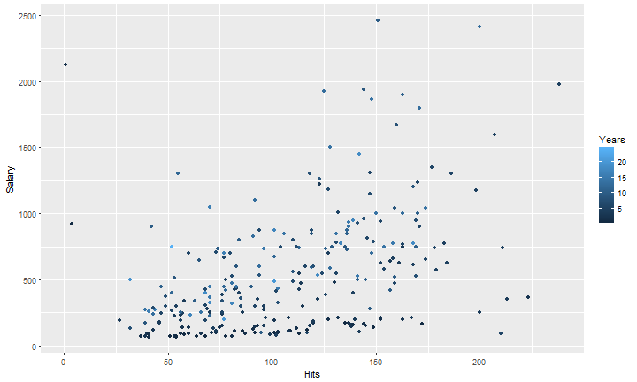

## The Data

The Hitters Data from the ISLR package contains Major League Baseball Data from the 1986 and 1987 seasons.  
It contains Salary information which the provided Application is trying to predict.

Target Variable
- Salary: 1987 annual salary on opening day in thousands of dollars

Predictors
- Hits: Number of hits in 1986
- Years: Number of years in the major leagues


---

## Data Points

The following plot shows an overview of the available Data Points used for the predicition.  
It shows the realtionship of Hits to Salaries. Years of experience are coloured.





---

## The Application


- To use the application choose the application tab and select the parameters with the sliders on the left hand side.   
Press the Submit button to provide the application with the selected data.
- The plot shows the relation of Hits with annual salaries as given in the data set.  
Coloring of the points hints at the years of experience of the player associated with the data point.
- The green line shows the linear relationship between Hits and Salary.
- The actual predicition also takes into account the years of experience and is shown below the plot.


---

## Prediction Details

The following linear model is used to make salary predictions


```r

  modfit <- lm(Salary ~ Years + Hits, data = Hitters)

```

After hiting the Submut button the predicted Salary is shown in thousands of Dollars. 


